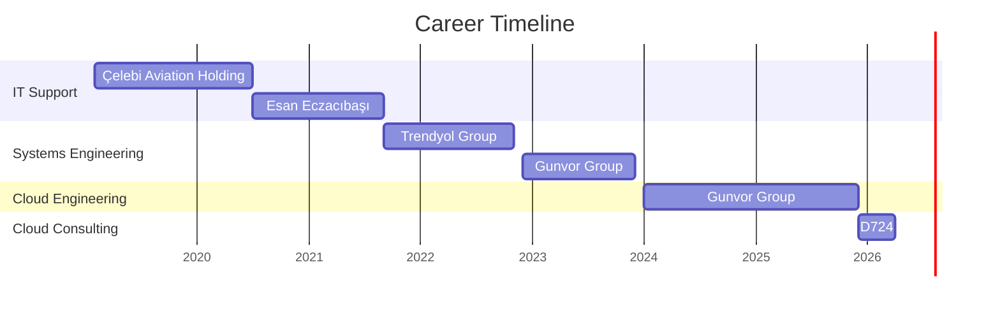
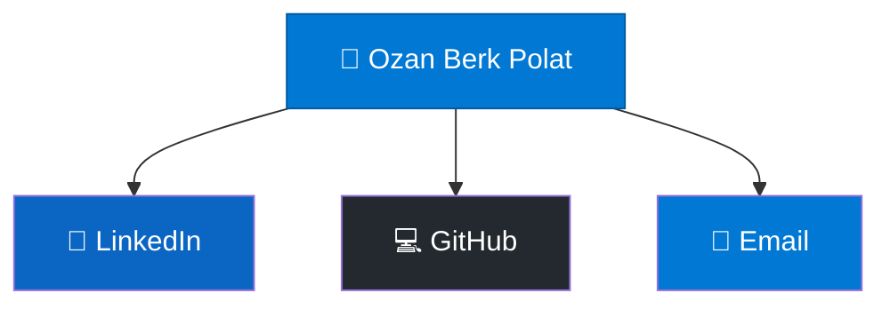
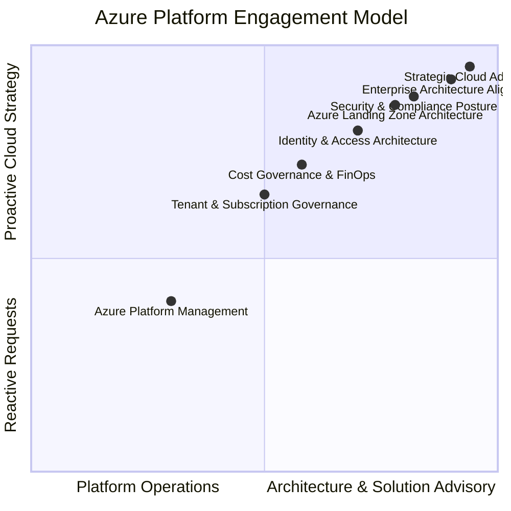

# Ozan Berk Polat
**Azure Cloud Consultant | Solution Design & Platform Architecture** 📍 Istanbul, Turkey

{: style="width: 800px; max-width: 100%; aspect-ratio: 16/9; object-fit: cover; display: block; margin: 0 auto; margin-bottom: 20px; border-radius: 12px;" }

---

## 🚀 Professional Summary
Working at the intersection of Azure architecture and enterprise operations, I specialize in both long-term platform ownership and project-based technical advisory across a range of industries and customer profiles. From managing the full Azure footprint of a major European bank to designing solutions for customers with complex, time-sensitive challenges, I bring the same mindset to every engagement: secure, compliant, and built to last.

---

## 💼 Professional Evolution

---

## 📜 Certifications

| **Certification** | **Status** |
|:---|:---|
| Azure Administrator Associate | ✅ Active |
| Azure Security Engineer Associate | ✅ Active |
| Microsoft Entra Specialist | ✅ Active |
| M365 Administrator Expert | ✅ Active |
| Security, Compliance & Identity Fundamentals | ✅ Active |

> My certifications reflect my strategic focus on **identity-first security** and **infrastructure resilience** across enterprise environments.
{: .prompt-tip }

---

## 🚦 How I Rate Myself

Let's be real. Nobody knows everything in the cloud. Here is how I break down my comfort zone with different Azure services. As someone working towards a Cloud Solution Architect role, I value infrastructure as code (IaC), operational resilience, and understanding the architectural "why" behind every service:

| Rating | Proficiency Level Description |
|:---:|:---|
| <i class="fas fa-star" style="color: #ffc107;"></i><i class="far fa-star" style="color: #ffc107;"></i><i class="far fa-star" style="color: #ffc107;"></i><i class="far fa-star" style="color: #ffc107;"></i><i class="far fa-star" style="color: #ffc107;"></i> | **1 Star:** No hands-on experience yet. |
| <i class="fas fa-star" style="color: #ffc107;"></i><i class="fas fa-star" style="color: #ffc107;"></i><i class="far fa-star" style="color: #ffc107;"></i><i class="far fa-star" style="color: #ffc107;"></i><i class="far fa-star" style="color: #ffc107;"></i> | **2 Stars:** Understand the core concepts.  I can handle basic deployments, standard day-to-day management,  and know what business problem the service solves. |
| <i class="fas fa-star" style="color: #ffc107;"></i><i class="fas fa-star" style="color: #ffc107;"></i><i class="fas fa-star" style="color: #ffc107;"></i><i class="far fa-star" style="color: #ffc107;"></i><i class="far fa-star" style="color: #ffc107;"></i> | **3 Stars:** Solid operational experience.  I can deploy from scratch, troubleshoot existing setups,  and weigh the pros and cons when making mid-level architecture decisions. |
| <i class="fas fa-star" style="color: #ffc107;"></i><i class="fas fa-star" style="color: #ffc107;"></i><i class="fas fa-star" style="color: #ffc107;"></i><i class="fas fa-star" style="color: #ffc107;"></i><i class="far fa-star" style="color: #ffc107;"></i> | **4 Stars:** Enterprise-ready.  I can design the architecture, deploy via Bicep/IaC using best practices,  and fully optimize, scale, and manage complex production workloads. |
| <i class="fas fa-star" style="color: #ffc107;"></i><i class="fas fa-star" style="color: #ffc107;"></i><i class="fas fa-star" style="color: #ffc107;"></i><i class="fas fa-star" style="color: #ffc107;"></i><i class="fas fa-star" style="color: #ffc107;"></i> | **5 Stars:** Nobody is perfect :) |

> **Note:** My highest self-rating is 4 stars. The cloud ecosystem is constantly evolving, and a good architect knows there is always more to learn.
{: .prompt-info }

---

## 🛠 The Azure Matrix

*(Click on any category to expand and see my specific service proficiencies)*

<b>🖥 Compute & Containers</b>

| Service | Proficiency |
|:---|:---|
| **Virtual machines** | <i class="fas fa-star" style="color: #ffc107;"></i><i class="fas fa-star" style="color: #ffc107;"></i><i class="fas fa-star" style="color: #ffc107;"></i><i class="fas fa-star" style="color: #ffc107;"></i><i class="far fa-star" style="color: #ffc107;"></i> |
| **Virtual machine scale sets** | <i class="fas fa-star" style="color: #ffc107;"></i><i class="fas fa-star" style="color: #ffc107;"></i><i class="fas fa-star" style="color: #ffc107;"></i><i class="fas fa-star" style="color: #ffc107;"></i><i class="far fa-star" style="color: #ffc107;"></i> |
| **App Services** | <i class="fas fa-star" style="color: #ffc107;"></i><i class="fas fa-star" style="color: #ffc107;"></i><i class="fas fa-star" style="color: #ffc107;"></i><i class="fas fa-star" style="color: #ffc107;"></i><i class="far fa-star" style="color: #ffc107;"></i> |
| **Function App** | <i class="fas fa-star" style="color: #ffc107;"></i><i class="fas fa-star" style="color: #ffc107;"></i><i class="fas fa-star" style="color: #ffc107;"></i><i class="fas fa-star" style="color: #ffc107;"></i><i class="far fa-star" style="color: #ffc107;"></i> |
| Azure Virtual Desktop | <i class="fas fa-star" style="color: #ffc107;"></i><i class="fas fa-star" style="color: #ffc107;"></i><i class="fas fa-star" style="color: #ffc107;"></i><i class="far fa-star" style="color: #ffc107;"></i><i class="far fa-star" style="color: #ffc107;"></i> |
| Kubernetes services (AKS) | <i class="fas fa-star" style="color: #ffc107;"></i><i class="fas fa-star" style="color: #ffc107;"></i><i class="fas fa-star" style="color: #ffc107;"></i><i class="far fa-star" style="color: #ffc107;"></i><i class="far fa-star" style="color: #ffc107;"></i> |
| Container Apps | <i class="fas fa-star" style="color: #ffc107;"></i><i class="fas fa-star" style="color: #ffc107;"></i><i class="fas fa-star" style="color: #ffc107;"></i><i class="far fa-star" style="color: #ffc107;"></i><i class="far fa-star" style="color: #ffc107;"></i> |
| Container registries | <i class="fas fa-star" style="color: #ffc107;"></i><i class="fas fa-star" style="color: #ffc107;"></i><i class="fas fa-star" style="color: #ffc107;"></i><i class="far fa-star" style="color: #ffc107;"></i><i class="far fa-star" style="color: #ffc107;"></i> |
| Container instances | <i class="fas fa-star" style="color: #ffc107;"></i><i class="fas fa-star" style="color: #ffc107;"></i><i class="fas fa-star" style="color: #ffc107;"></i><i class="far fa-star" style="color: #ffc107;"></i><i class="far fa-star" style="color: #ffc107;"></i> |
| Availability sets | <i class="fas fa-star" style="color: #ffc107;"></i><i class="fas fa-star" style="color: #ffc107;"></i><i class="far fa-star" style="color: #ffc107;"></i><i class="far fa-star" style="color: #ffc107;"></i><i class="far fa-star" style="color: #ffc107;"></i> |

<b>🔐 Identity & Security</b>

| Service | Proficiency |
|:---|:---|
| **Microsoft Entra ID** | <i class="fas fa-star" style="color: #ffc107;"></i><i class="fas fa-star" style="color: #ffc107;"></i><i class="fas fa-star" style="color: #ffc107;"></i><i class="fas fa-star" style="color: #ffc107;"></i><i class="far fa-star" style="color: #ffc107;"></i> |
| **Microsoft Entra PIM** | <i class="fas fa-star" style="color: #ffc107;"></i><i class="fas fa-star" style="color: #ffc107;"></i><i class="fas fa-star" style="color: #ffc107;"></i><i class="fas fa-star" style="color: #ffc107;"></i><i class="far fa-star" style="color: #ffc107;"></i> |
| **Microsoft Entra Domain Services** | <i class="fas fa-star" style="color: #ffc107;"></i><i class="fas fa-star" style="color: #ffc107;"></i><i class="fas fa-star" style="color: #ffc107;"></i><i class="fas fa-star" style="color: #ffc107;"></i><i class="far fa-star" style="color: #ffc107;"></i> |
| **Microsoft Entra ID Protection** | <i class="fas fa-star" style="color: #ffc107;"></i><i class="fas fa-star" style="color: #ffc107;"></i><i class="fas fa-star" style="color: #ffc107;"></i><i class="fas fa-star" style="color: #ffc107;"></i><i class="far fa-star" style="color: #ffc107;"></i> |
| **Identity Governance** | <i class="fas fa-star" style="color: #ffc107;"></i><i class="fas fa-star" style="color: #ffc107;"></i><i class="fas fa-star" style="color: #ffc107;"></i><i class="fas fa-star" style="color: #ffc107;"></i><i class="far fa-star" style="color: #ffc107;"></i> |
| **Managed Identities** | <i class="fas fa-star" style="color: #ffc107;"></i><i class="fas fa-star" style="color: #ffc107;"></i><i class="fas fa-star" style="color: #ffc107;"></i><i class="fas fa-star" style="color: #ffc107;"></i><i class="far fa-star" style="color: #ffc107;"></i> |
| **App registrations** | <i class="fas fa-star" style="color: #ffc107;"></i><i class="fas fa-star" style="color: #ffc107;"></i><i class="fas fa-star" style="color: #ffc107;"></i><i class="fas fa-star" style="color: #ffc107;"></i><i class="far fa-star" style="color: #ffc107;"></i> |
| **Key vaults** | <i class="fas fa-star" style="color: #ffc107;"></i><i class="fas fa-star" style="color: #ffc107;"></i><i class="fas fa-star" style="color: #ffc107;"></i><i class="fas fa-star" style="color: #ffc107;"></i><i class="far fa-star" style="color: #ffc107;"></i> |
| Microsoft Defender for Cloud | <i class="fas fa-star" style="color: #ffc107;"></i><i class="fas fa-star" style="color: #ffc107;"></i><i class="fas fa-star" style="color: #ffc107;"></i><i class="far fa-star" style="color: #ffc107;"></i><i class="far fa-star" style="color: #ffc107;"></i> |
| Web Application Firewall policies (WAF) | <i class="fas fa-star" style="color: #ffc107;"></i><i class="fas fa-star" style="color: #ffc107;"></i><i class="fas fa-star" style="color: #ffc107;"></i><i class="far fa-star" style="color: #ffc107;"></i><i class="far fa-star" style="color: #ffc107;"></i> |
| Microsoft Sentinel | <i class="fas fa-star" style="color: #ffc107;"></i><i class="fas fa-star" style="color: #ffc107;"></i><i class="far fa-star" style="color: #ffc107;"></i><i class="far fa-star" style="color: #ffc107;"></i><i class="far fa-star" style="color: #ffc107;"></i> |

<b>🌐 Networking</b>

| Service | Proficiency |
|:---|:---|
| **Virtual networks** | <i class="fas fa-star" style="color: #ffc107;"></i><i class="fas fa-star" style="color: #ffc107;"></i><i class="fas fa-star" style="color: #ffc107;"></i><i class="fas fa-star" style="color: #ffc107;"></i><i class="far fa-star" style="color: #ffc107;"></i> |
| **Network security groups** | <i class="fas fa-star" style="color: #ffc107;"></i><i class="fas fa-star" style="color: #ffc107;"></i><i class="fas fa-star" style="color: #ffc107;"></i><i class="fas fa-star" style="color: #ffc107;"></i><i class="far fa-star" style="color: #ffc107;"></i> |
| **DNS zones** | <i class="fas fa-star" style="color: #ffc107;"></i><i class="fas fa-star" style="color: #ffc107;"></i><i class="fas fa-star" style="color: #ffc107;"></i><i class="fas fa-star" style="color: #ffc107;"></i><i class="far fa-star" style="color: #ffc107;"></i> |
| Application gateways | <i class="fas fa-star" style="color: #ffc107;"></i><i class="fas fa-star" style="color: #ffc107;"></i><i class="fas fa-star" style="color: #ffc107;"></i><i class="far fa-star" style="color: #ffc107;"></i><i class="far fa-star" style="color: #ffc107;"></i> |
| Load balancers | <i class="fas fa-star" style="color: #ffc107;"></i><i class="fas fa-star" style="color: #ffc107;"></i><i class="fas fa-star" style="color: #ffc107;"></i><i class="far fa-star" style="color: #ffc107;"></i><i class="far fa-star" style="color: #ffc107;"></i> |
| ExpressRoute circuits | <i class="fas fa-star" style="color: #ffc107;"></i><i class="fas fa-star" style="color: #ffc107;"></i><i class="fas fa-star" style="color: #ffc107;"></i><i class="far fa-star" style="color: #ffc107;"></i><i class="far fa-star" style="color: #ffc107;"></i> |
| Virtual network gateways | <i class="fas fa-star" style="color: #ffc107;"></i><i class="fas fa-star" style="color: #ffc107;"></i><i class="fas fa-star" style="color: #ffc107;"></i><i class="far fa-star" style="color: #ffc107;"></i><i class="far fa-star" style="color: #ffc107;"></i> |
| Front Doors | <i class="fas fa-star" style="color: #ffc107;"></i><i class="fas fa-star" style="color: #ffc107;"></i><i class="far fa-star" style="color: #ffc107;"></i><i class="far fa-star" style="color: #ffc107;"></i><i class="far fa-star" style="color: #ffc107;"></i> |
| Bastions | <i class="fas fa-star" style="color: #ffc107;"></i><i class="fas fa-star" style="color: #ffc107;"></i><i class="far fa-star" style="color: #ffc107;"></i><i class="far fa-star" style="color: #ffc107;"></i><i class="far fa-star" style="color: #ffc107;"></i> |
| Firewalls | <i class="fas fa-star" style="color: #ffc107;"></i><i class="fas fa-star" style="color: #ffc107;"></i><i class="far fa-star" style="color: #ffc107;"></i><i class="far fa-star" style="color: #ffc107;"></i><i class="far fa-star" style="color: #ffc107;"></i> |

<b>⚙️ Management & Governance</b>

| Service | Proficiency |
|:---|:---|
| **Policy** | <i class="fas fa-star" style="color: #ffc107;"></i><i class="fas fa-star" style="color: #ffc107;"></i><i class="fas fa-star" style="color: #ffc107;"></i><i class="fas fa-star" style="color: #ffc107;"></i><i class="far fa-star" style="color: #ffc107;"></i> |
| **Automation Accounts** | <i class="fas fa-star" style="color: #ffc107;"></i><i class="fas fa-star" style="color: #ffc107;"></i><i class="fas fa-star" style="color: #ffc107;"></i><i class="fas fa-star" style="color: #ffc107;"></i><i class="far fa-star" style="color: #ffc107;"></i> |
| **Cost Management + Billing** | <i class="fas fa-star" style="color: #ffc107;"></i><i class="fas fa-star" style="color: #ffc107;"></i><i class="fas fa-star" style="color: #ffc107;"></i><i class="fas fa-star" style="color: #ffc107;"></i><i class="far fa-star" style="color: #ffc107;"></i> |
| **Subscriptions** | <i class="fas fa-star" style="color: #ffc107;"></i><i class="fas fa-star" style="color: #ffc107;"></i><i class="fas fa-star" style="color: #ffc107;"></i><i class="fas fa-star" style="color: #ffc107;"></i><i class="far fa-star" style="color: #ffc107;"></i> |
| **Azure Advisor** | <i class="fas fa-star" style="color: #ffc107;"></i><i class="fas fa-star" style="color: #ffc107;"></i><i class="fas fa-star" style="color: #ffc107;"></i><i class="fas fa-star" style="color: #ffc107;"></i><i class="far fa-star" style="color: #ffc107;"></i> |
| **Azure Resource Mover** | <i class="fas fa-star" style="color: #ffc107;"></i><i class="fas fa-star" style="color: #ffc107;"></i><i class="fas fa-star" style="color: #ffc107;"></i><i class="fas fa-star" style="color: #ffc107;"></i><i class="far fa-star" style="color: #ffc107;"></i> |
| **Machines - Azure Arc** | <i class="fas fa-star" style="color: #ffc107;"></i><i class="fas fa-star" style="color: #ffc107;"></i><i class="fas fa-star" style="color: #ffc107;"></i><i class="fas fa-star" style="color: #ffc107;"></i><i class="far fa-star" style="color: #ffc107;"></i> |
| Azure Migrate | <i class="fas fa-star" style="color: #ffc107;"></i><i class="fas fa-star" style="color: #ffc107;"></i><i class="fas fa-star" style="color: #ffc107;"></i><i class="far fa-star" style="color: #ffc107;"></i><i class="far fa-star" style="color: #ffc107;"></i> |

<b>📊 Monitoring & Analytics</b>

| Service | Proficiency |
|:---|:---|
| **Log Analytics workspaces** | <i class="fas fa-star" style="color: #ffc107;"></i><i class="fas fa-star" style="color: #ffc107;"></i><i class="fas fa-star" style="color: #ffc107;"></i><i class="fas fa-star" style="color: #ffc107;"></i><i class="far fa-star" style="color: #ffc107;"></i> |
| **Application Insights** | <i class="fas fa-star" style="color: #ffc107;"></i><i class="fas fa-star" style="color: #ffc107;"></i><i class="fas fa-star" style="color: #ffc107;"></i><i class="fas fa-star" style="color: #ffc107;"></i><i class="far fa-star" style="color: #ffc107;"></i> |
| **Alerts** | <i class="fas fa-star" style="color: #ffc107;"></i><i class="fas fa-star" style="color: #ffc107;"></i><i class="fas fa-star" style="color: #ffc107;"></i><i class="fas fa-star" style="color: #ffc107;"></i><i class="far fa-star" style="color: #ffc107;"></i> |
| **Metrics** | <i class="fas fa-star" style="color: #ffc107;"></i><i class="fas fa-star" style="color: #ffc107;"></i><i class="fas fa-star" style="color: #ffc107;"></i><i class="fas fa-star" style="color: #ffc107;"></i><i class="far fa-star" style="color: #ffc107;"></i> |
| **Azure Workbooks** | <i class="fas fa-star" style="color: #ffc107;"></i><i class="fas fa-star" style="color: #ffc107;"></i><i class="fas fa-star" style="color: #ffc107;"></i><i class="fas fa-star" style="color: #ffc107;"></i><i class="far fa-star" style="color: #ffc107;"></i> |
| Data factories | <i class="fas fa-star" style="color: #ffc107;"></i><i class="fas fa-star" style="color: #ffc107;"></i><i class="fas fa-star" style="color: #ffc107;"></i><i class="far fa-star" style="color: #ffc107;"></i><i class="far fa-star" style="color: #ffc107;"></i> |
| Managed Prometheus | <i class="fas fa-star" style="color: #ffc107;"></i><i class="fas fa-star" style="color: #ffc107;"></i><i class="far fa-star" style="color: #ffc107;"></i><i class="far fa-star" style="color: #ffc107;"></i><i class="far fa-star" style="color: #ffc107;"></i> |
| Network Watcher | <i class="fas fa-star" style="color: #ffc107;"></i><i class="fas fa-star" style="color: #ffc107;"></i><i class="far fa-star" style="color: #ffc107;"></i><i class="far fa-star" style="color: #ffc107;"></i><i class="far fa-star" style="color: #ffc107;"></i> |

<b>💾 Storage & BCDR</b>

| Service | Proficiency |
|:---|:---|
| **Storage accounts** | <i class="fas fa-star" style="color: #ffc107;"></i><i class="fas fa-star" style="color: #ffc107;"></i><i class="fas fa-star" style="color: #ffc107;"></i><i class="fas fa-star" style="color: #ffc107;"></i><i class="far fa-star" style="color: #ffc107;"></i> |
| **Disks** | <i class="fas fa-star" style="color: #ffc107;"></i><i class="fas fa-star" style="color: #ffc107;"></i><i class="fas fa-star" style="color: #ffc107;"></i><i class="fas fa-star" style="color: #ffc107;"></i><i class="far fa-star" style="color: #ffc107;"></i> |
| **Recovery Services vaults** | <i class="fas fa-star" style="color: #ffc107;"></i><i class="fas fa-star" style="color: #ffc107;"></i><i class="fas fa-star" style="color: #ffc107;"></i><i class="fas fa-star" style="color: #ffc107;"></i><i class="far fa-star" style="color: #ffc107;"></i> |

<b>🔗 Integration & Web</b>

| Service | Proficiency |
|:---|:---|
| **Logic apps** | <i class="fas fa-star" style="color: #ffc107;"></i><i class="fas fa-star" style="color: #ffc107;"></i><i class="fas fa-star" style="color: #ffc107;"></i><i class="fas fa-star" style="color: #ffc107;"></i><i class="far fa-star" style="color: #ffc107;"></i> |
| **Communication Services** | <i class="fas fa-star" style="color: #ffc107;"></i><i class="fas fa-star" style="color: #ffc107;"></i><i class="fas fa-star" style="color: #ffc107;"></i><i class="fas fa-star" style="color: #ffc107;"></i><i class="far fa-star" style="color: #ffc107;"></i> |
| API Management services | <i class="fas fa-star" style="color: #ffc107;"></i><i class="fas fa-star" style="color: #ffc107;"></i><i class="fas fa-star" style="color: #ffc107;"></i><i class="far fa-star" style="color: #ffc107;"></i><i class="far fa-star" style="color: #ffc107;"></i> |
| Service Bus | <i class="fas fa-star" style="color: #ffc107;"></i><i class="fas fa-star" style="color: #ffc107;"></i><i class="far fa-star" style="color: #ffc107;"></i><i class="far fa-star" style="color: #ffc107;"></i><i class="far fa-star" style="color: #ffc107;"></i> |

<b>🛠 DevOps & Misc</b>

| Service | Proficiency |
|:---|:---|
| Azure DevOps organizations | <i class="fas fa-star" style="color: #ffc107;"></i><i class="fas fa-star" style="color: #ffc107;"></i><i class="fas fa-star" style="color: #ffc107;"></i><i class="far fa-star" style="color: #ffc107;"></i><i class="far fa-star" style="color: #ffc107;"></i> |
| GitHub | <i class="fas fa-star" style="color: #ffc107;"></i><i class="fas fa-star" style="color: #ffc107;"></i><i class="far fa-star" style="color: #ffc107;"></i><i class="far fa-star" style="color: #ffc107;"></i><i class="far fa-star" style="color: #ffc107;"></i> |

---

### Current Role: **Azure Cloud Consultant** | D724 IT Services, A Datamarket Company
*Dec 2025 – Present*

🔧 **Key Responsibilities:**

- Architecting and managing the end-to-end Azure platform for a major European bank under a long-running managed services agreement, taking full technical ownership across all aspects of the environment including cost governance, security posture, networking, compute, and infrastructure-as-code delivery using bespoke Bicep templates tailored to the bank's specific requirements.

- Continuously driving platform optimization for the bank through structured analysis across cost efficiency, resource governance, and Azure best practices, translating findings into actionable improvements that keep the environment compliant, audit-ready, performant, and future-ready.

- Leading short-cycle solution design and advisory engagements for EA and CSP customers referred through Datamarket, assessing complex technical challenges and delivering secure, compliant, and actionable architecture recommendations across areas such as cost optimization, network infrastructure, cloud-native communication services, and content delivery.

- Delivering solution design and hands-on technical implementation across diverse industries including automotive, food & beverage, banking, and insurance through project-based engagements, adapting architecture thinking to varied environments, regulatory constraints, and organizational maturity levels.

- Collaborating with the Datamarket pre-sales team on technically complex opportunities, contributing to service scoping, effort estimation, and solution positioning where deep Azure expertise is critical to shaping the right commercial outcome.

📝 **Recent Projects & Publications:**

• **Video Content Delivery Architecture** (Jan 2026): Designed and implemented secure video streaming solutions using Azure Front Door and Blob Storage for large banking applications, ensuring high-performance content delivery with advanced security controls.

• **Comprehensive Disaster Recovery Testing** (Jan 2026): Led full-scale database and infrastructure restore testing in isolated Azure environments, validating recovery procedures for Oracle databases and Active Directory components.

• **Real-Time RPO Monitoring Solution** (Mar 2026): Developed API-driven RPO monitoring for a major European bank, transitioning from log-based to real-time monitoring to achieve second-level accuracy in compliance reporting.

> In the financial sector, precision in RPO monitoring is not optional—it's a regulatory requirement. My solutions ensure second-level accuracy in disaster recovery visibility.
{: .prompt-warning }

• **Automated VM Utilization Reporting** (Mar 2026): Created Logic Apps-based automation for monthly VM resource utilization reports, incorporating CPU, memory, and storage metrics with business-hours filtering for accurate workload analysis.

• **Enterprise FinOps Automation** (Mar 2026): Architected production-hardened cost management workflows using Azure Logic Apps, enabling multi-granular cost reporting and automated Excel report generation for large-scale organizations.

### Previous Roles

| **Company** | **Position** | **Period** | **Focus** |
|:---|:---|:---|:---|
| Gunvor Group | Cloud Engineer | Jan 2024 – Dec 2025 | Azure & Entra ID, Bicep IaC |
| Gunvor Group | System Engineer | Dec 2022 – Dec 2023 | Global virtualization, Hybrid cloud |
| Trendyol Group | System Engineer | Sep 2021 – Nov 2022 | 300+ branches, Global infrastructure |
| Eczacıbaşı Topluluğu | IT Specialist | Jul 2020 – Sep 2021 | Enterprise IT support |
| Çelebi Aviation Holding | IT Specialist | Feb 2019 – Jul 2020 | Aviation IT operations |

---

## 📧 Connect & Collaborate

---

## ☁️ Azure Engagement Model

> **Core Principle:** My approach is defined by **"Cloud-First & Automated-Always."** I leverage **Bicep** and **PowerShell** to ensure that enterprise environments are not only scalable but also inherently secure and compliant by design.
> 
> **Vision:** My vision is to automate any repetitive, error-prone, or tedious tasks wherever possible, and focus on creating architectural designs to solve customer problems.
{: .prompt-tip }

---

> The cloud is not just infrastructure—it's a platform for **innovation**, **resilience**, and **transformation**. I'm committed to helping organizations unlock its full potential.
{: .prompt-note }