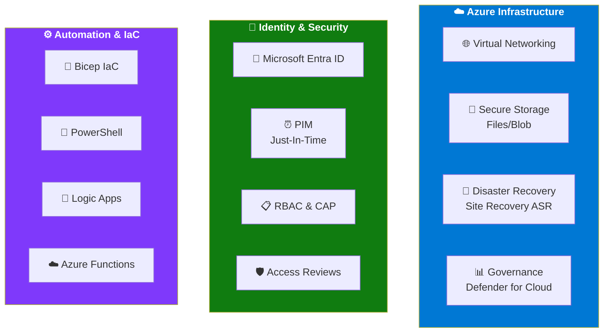
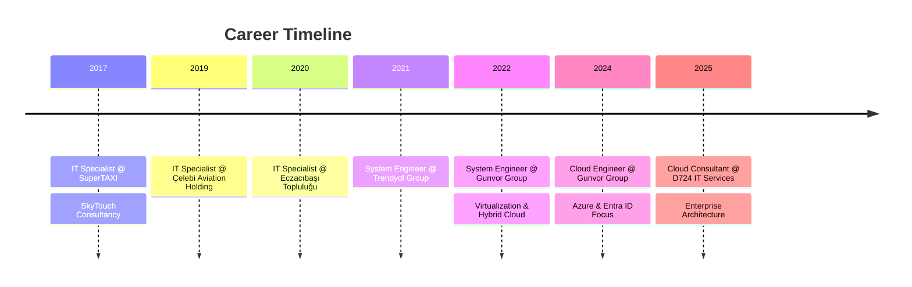
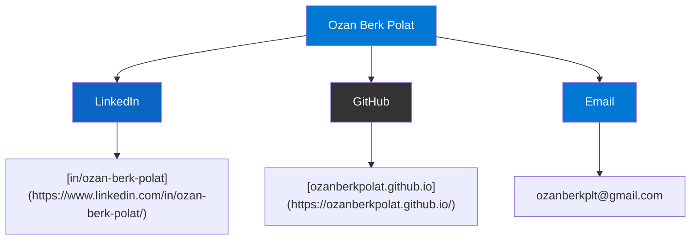
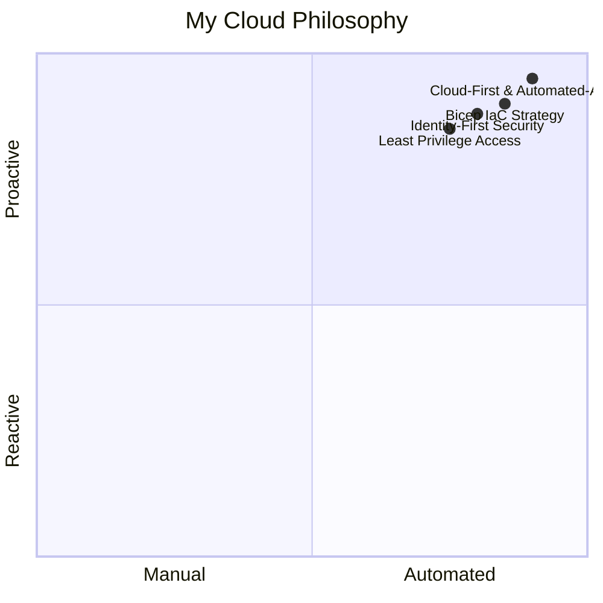

# Ozan Berk Polat
**Cloud Consultant / Cloud Engineer** 📍 Istanbul, Turkey

{: style="border-radius: 50%; width: 150px; height: 150px; object-fit: cover; display: block; margin: 0 auto; margin-bottom: 20px;" }

---

## 🚀 Professional Summary
Working at the intersection of **Azure architecture** and **enterprise operations**, I specialize in bridging the gap between high-level design and reliable, large-scale implementation. I combine the management of **highly regulated environments** with **targeted advisory engagements**, ensuring that complex infrastructure challenges are addressed with solutions that are not only secure and compliant but also operationally resilient.

---

## 🛠 Cloud Tech Stack & Expertise

While I have a deep background in infrastructure, my current professional focus is dedicated to the Cloud ecosystem:

### <i class="fab fa-microsoft" style="color: #0078d4;"></i> Azure Infrastructure
* **Cloud Architecture:** Design and management of Virtual Networking, Secure Storage (Files/Blob), and resource governance for EA/CSP customers.
* **Business Continuity:** Implementing large-scale Disaster Recovery and migration strategies using **Azure Site Recovery (ASR)**.
* **Governance & Cost:** Enforcing policies, resource right-sizing, and cost optimization within Microsoft Defender for Cloud.

### <i class="fas fa-shield-alt" style="color: #107c10;"></i> Identity & Access Management (IAM)
* **Microsoft Entra ID:** Advanced orchestration of **RBAC**, **Privileged Identity Management (PIM)**, and Identity Governance.
* **Security Models:** Designing **Conditional Access** policies, MFA, and "Least Privilege" access frameworks for enterprise tenants.

### <i class="fas fa-code" style="color: #7f39fb;"></i> Automation & IaC
* **Infrastructure as Code:** Developing modular and reusable deployments using **Bicep** to ensure cross-subscription consistency.
* **Cloud Automation:** Utilizing **PowerShell** and serverless workflows to automate identity monitoring and platform health checks.
* **Modern Workplace:** Managing cloud-based identities and endpoints via **Microsoft 365** and **Intune**.

---

## 📜 Certifications & Technical Proficiency

| **Domain** | **Certification** | **Status** |
|:---|:---|:---|
| **Cloud Administration** | Azure Administrator Associate | ✅ Active |
| **Cloud Security** | Azure Security Engineer Associate | ✅ Active |
| **Identity & Access** | Microsoft Entra Specialist | ✅ Active |
| **Microsoft 365** | M365 Administrator Expert | ✅ Active |
| **Fundamentals** | Security, Compliance & Identity Fundamentals | ✅ Active |

> My certifications reflect my strategic focus on **identity-first security** and **infrastructure resilience** across enterprise environments.
{: .prompt-tip }

---

## 💼 Professional Evolution

### Current Role: **Cloud Technologies Consultant** | D724 IT Services Inc.
*Dec 2025 – Present*

🔧 **Key Responsibilities & Achievements:**

• **Technical Advisory & Solution Design:** Delivering technical deep dives, architecture guidance, and targeted solution design for EA and CSP customers, addressing complex challenges through high-level technical advisory.

• **Advisory Engagements:** Leading short-cycle advisory engagements to analyze customer challenges and provide secure, compliant, and actionable remediation recommendations.

• **Operational Management:** Providing end-to-end operational management of highly regulated Azure environments, overseeing solution design and continuous improvement to ensure platform stability and cost efficiency.

• **Disaster Recovery Leadership:** Leading disaster recovery preparedness by developing comprehensive recovery plans and orchestrating large-scale failover testing, while ensuring 100% backup coverage for both existing and newly provisioned workloads.

• **Enterprise Observability:** Engineering enterprise-grade observability and bespoke alerting mechanisms to address platform "blind spots"; utilizing Zabbix with custom templates for monitoring and Azure Logic Apps to architect custom alerting mechanisms for things such as tracking RPO thresholds and PITR compliance.

• **Automated Reporting:** Automating the delivery of both standard and custom-tailored reports, establishing streamlined and actionable visibility for technical and business stakeholders.

📝 **Recent Projects & Publications:**

• **Video Content Delivery Architecture** (Jan 2026): Designed and implemented secure video streaming solutions using Azure Front Door and Blob Storage for large banking applications, ensuring high-performance content delivery with advanced security controls.

• **Comprehensive Disaster Recovery Testing** (Jan 2026): Led full-scale database and infrastructure restore testing in isolated Azure environments, validating recovery procedures for Oracle databases and Active Directory components.

• **Real-Time RPO Monitoring Solution** (Mar 2026): Developed API-driven RPO monitoring for a major European bank, transitioning from log-based to real-time monitoring to achieve second-level accuracy in compliance reporting.

> In the financial sector, precision in RPO monitoring is not optional—it's a regulatory requirement. My solutions ensure second-level accuracy in disaster recovery visibility.
{: .prompt-warning }

• **Automated VM Utilization Reporting** (Mar 2026): Created Logic Apps-based automation for monthly VM resource utilization reports, incorporating CPU, memory, and storage metrics with business-hours filtering for accurate workload analysis.

• **Enterprise FinOps Automation** (Mar 2026): Architected production-hardened cost management workflows using Azure Logic Apps, enabling multi-granular cost reporting and automated Excel report generation for large-scale organizations.

### Previous Roles

| **Company** | **Position** | **Period** | **Focus** |
|:---|:---|:---|:---|
| Gunvor Group | Cloud Engineer | Jan 2024 – Dec 2025 | Azure & Entra ID, Bicep IaC |
| Gunvor Group | System Engineer | Dec 2022 – Dec 2023 | Global virtualization, Hybrid cloud |
| Trendyol Group | System Engineer | Sep 2021 – Dec 2022 | 300+ branches, Global infrastructure |
| Eczacıbaşı Topluluğu | IT Specialist | Jul 2020 – Sep 2021 | Enterprise IT support |
| Çelebi Aviation Holding | IT Specialist | Feb 2019 – Jul 2020 | Aviation IT operations |
| SkyTouch / SuperTAXI | IT Specialist | Oct 2017 – Feb 2019 | Startup IT infrastructure |

---

## 📧 Connect & Collaborate

---

## 🎯 Cloud Methodology

> **Core Principle:** My approach is defined by **"Cloud-First & Automated-Always."** I leverage **Bicep** and **PowerShell** to ensure that enterprise environments are not only scalable but also inherently secure and compliant by design.
> 
> **Vision:** My vision is to automate any repetitive, error-prone, or tedious tasks wherever possible, and focus on creating architectural designs to solve customer problems.
{: .prompt-tip }

---

## 🔮 Future Focus

- **Advanced FinOps Automation** for multi-region Azure deployments
- **Generative AI Integration** in cloud governance workflows  
- **Zero-Trust Architecture** implementation at enterprise scale
- Thought leadership on **identity-centric security** in hybrid cloud environments
- **Solution Architect Role:** To become a solution architect who possesses technical expertise in most Azure services and can design architectures that provide accurate solutions to customer requirements

> The cloud is not just infrastructure—it's a platform for **innovation**, **resilience**, and **transformation**. I'm committed to helping organizations unlock its full potential.
{: .prompt-note }